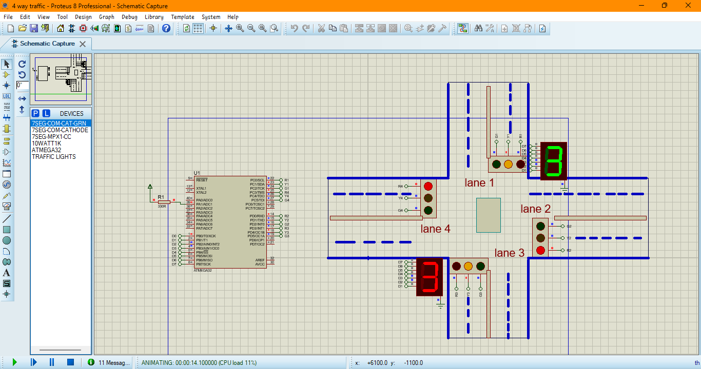

# ATmega32 4-Way Traffic Lights

## Overview
This project implements a **4-way traffic light control system** using an **ATmega32 microcontroller**. The code is written in **Atmel Studio** and simulated in **Proteus**.

## Features
- Controls traffic lights for four different directions.
- Implements timing for red, yellow, and green lights.
- Simulated in **Proteus** for validation.
- Efficient and structured **C code** for the microcontroller.

## Circuit Diagram
Below is an image of the complete project setup in Proteus:


*This image shows the Proteus simulation of the 4-way traffic light system, including the ATmega32 microcontroller, LEDs for traffic signals, and timing sequences for different directions.*

## Requirements
### Hardware:
- **ATmega32** microcontroller
- **LEDs (Red, Yellow, Green)**
- **Resistors**
- **Crystal Oscillator (16MHz)**
- **Capacitors (22pF)**
- **Power Supply (5V)**
- **Push Buttons (Optional for pedestrian mode)**

### Software:
- **Atmel Studio** (For writing and compiling code)
- **Proteus** (For simulation)

## Installation and Usage
1. Clone this repository:
   ```bash
   git clone https://github.com/sployal/Atmega32_4way-traficlights
   ```
2. Open the project in **Atmel Studio**.
3. Compile and upload the code to your ATmega32.
4. Open **Proteus** and load the provided simulation file.
5. Run the simulation and observe the traffic light sequencing.

## Code Structure
- `main.c`: Contains the main logic for controlling the traffic lights.
- `config.h`: Defines the pin connections and timing configurations.

## Simulation Demonstration
To see the project in action, refer to the **Proteus simulation file** included in this repository.

## License
This project is licensed under the **MIT License**.

## Author
Davie 